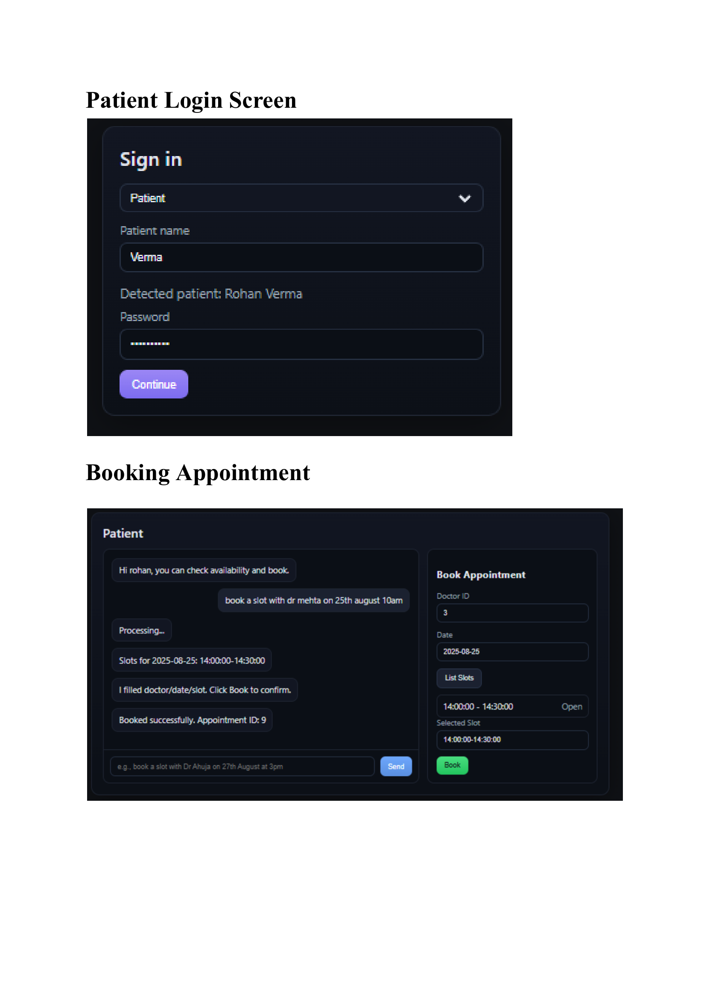

[View screenshots (PDF)](./ss.pdf)




## Dobbe – Patient & Report Agents

End-to-end agents with FastAPI, PostgreSQL, Groq LLM, Google Calendar + Gmail, and WhatsApp Cloud API. Includes REPLs and automated tests.

### Features
- Patient agent (LangGraph): list doctors availability, check a doctor, book, Calendar + Gmail notifications
- Report agent: counts (day/range), symptoms, “tell times on <date>”, busiest day, WhatsApp on request (“whatsapp me <query>”)
- Tool endpoints for email/calendar/WhatsApp
- Seed and test scripts; DB–agent verification

### Prerequisites
- Python 3.10+
- PostgreSQL with DB `clinicdb` (tables: doctors, patients, doctor_availability, appointments, patient_reports)
- Groq API key; optional Google OAuth (token.json); optional WhatsApp token/phone id

### Backend setup
```powershell
python -m venv venv
./venv/Scripts/Activate.ps1
pip install -r requirements.txt  # or see minimal list below
$env:GROQ_API_KEY="<your_groq_key>"
python app.py
```

Minimal packages if no requirements.txt:
```powershell
pip install fastapi uvicorn sqlalchemy psycopg2-binary pydantic google-api-python-client google-auth google-auth-oauthlib langchain-groq requests
```

### Environment
```powershell
$env:GROQ_API_KEY="<key>"
$env:GROQ_MODEL="llama3-8b-8192"
# Optional
$env:WHATSAPP_TOKEN="<meta_token>"
$env:WHATSAPP_PHONE_ID="<phone_id>"
$env:WHATSAPP_TO="<recipient_E164>"  # e.g., 919108281677
$env:REPORT_AGENT_TEST_TODAY="YYYY-MM-DD"  # pin “today” for testing
```

### Patient agent (REPL)
```powershell
python scripts\patient_agent_test.py
# examples: “what doctors are available today?”, “check Dr. Ahuja on 2025-08-26”, “book 10:30”
```

### Report agent (REPL)
```powershell
python scripts\report_agent_repl.py --doctor-id 1
# /help for commands; “whatsapp me <query>” to send via WhatsApp
```

### Automated tests
```powershell
python scripts\report_agent_edge_tests.py --doctor-id 1 --verbose
python scripts\report_agent_verify_db.py --doctor-id 1 --dates 2025-08-24 2025-08-26 --verbose
```

### Seeding
```powershell
python scripts\seed_booked_times.py --doctor-id 1 --date 2025-08-24 --slots 10:00-10:30 10:30-11:00 --patient-id 1
```

### Tools (MCP-style endpoints)
- `POST /tools/send_email` – { to, subject, body }
- `POST /tools/create_calendar_event` – { summary, start_iso, end_iso, attendee }
- `POST /tools/whatsapp_send` – { to, message } or { to, template_name, lang_code } (+ token/phone_id if not in env)

### Notes
- Frontend in `frontend/` is optional (`npm install && npm run start`); backend APIs are primary.
- Secrets: do not commit token.json or client secrets. Use env vars.

### Git
```powershell
git init
@"
__pycache__/
*.pyc
venv/
.venv/
.env
token.json
client_secret_*.json
frontend/node_modules/
frontend/dist/
.vscode/
.idea/
.DS_Store
Thumbs.db
"@ | Out-File -Encoding utf8 .gitignore
git add -A
git commit -m "Initial cleaned repo (no secrets)"
```


